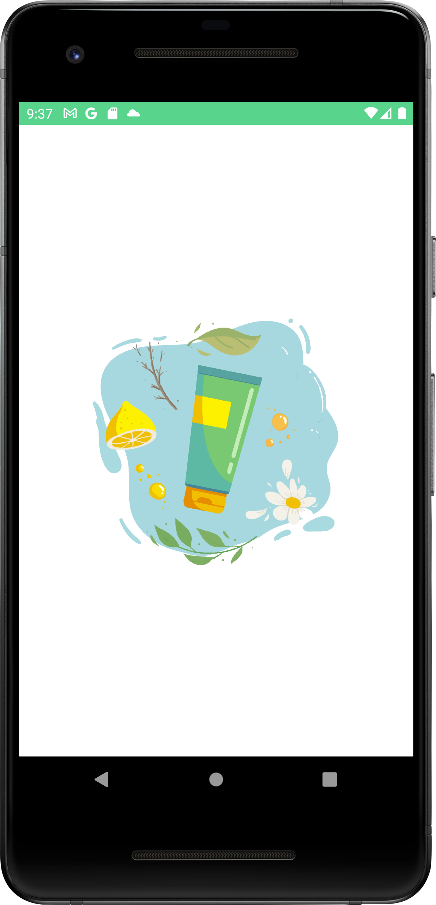
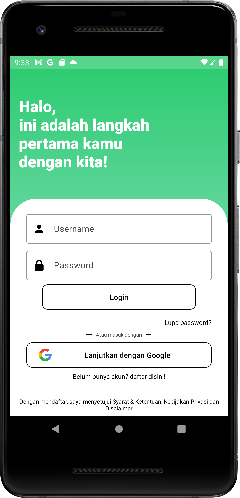
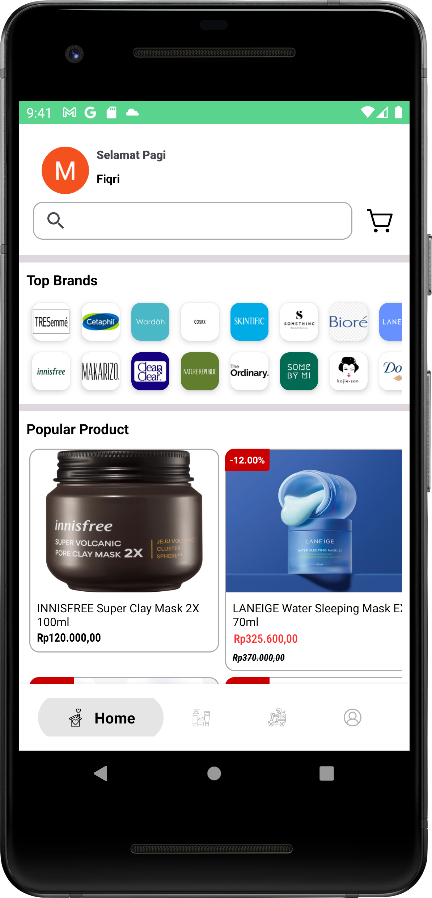
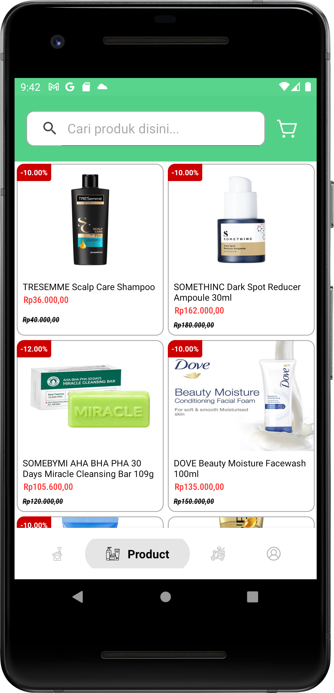
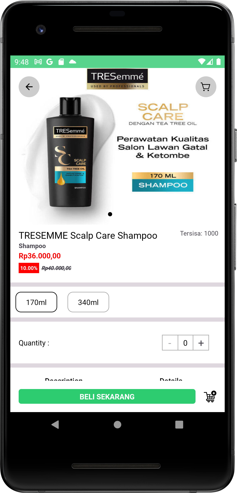
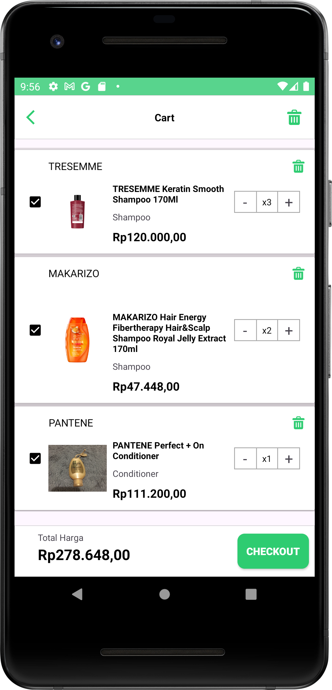
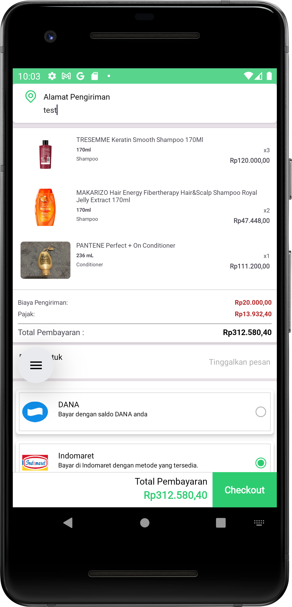
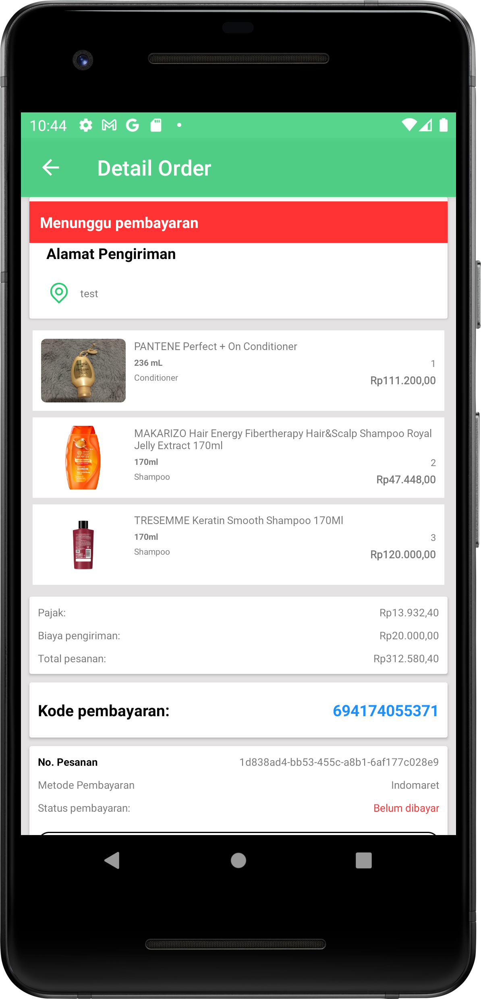
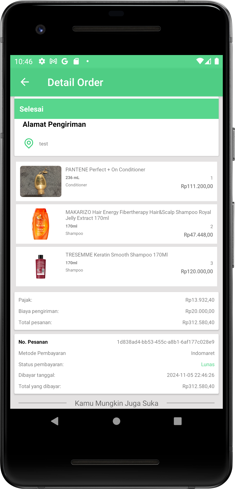

## SKINCAREAN 

An e-commerce skincare app that i built from scratch this app from scratch. There is some feature in this application such as user feature, admin, product, cart, order, payment, and many more.

## ABOUT PROJECT

* An ecommerce platform for skincare that has cart feature, checkout, order, product, user.
* Iam implement modern android development such as modularization, coroutine, depedency injection with koin, lottie, Clean architecture with MVVM, LiveData, Diffutil, Retrofit to communicate with backend, Google sign in api, firebase, and many more which i can mention one by one.
* The backend API is built using spring boot and also by me, you guys check on this link : https://github.com/hollymolly2708/skincarean-backend 
* Nothing special, im just built this for my fullstack portfolio HEHE :), but i really built this with all my heart.

## FEATURE

These are main feature in this application :

* User Authentication (Login/Sign Up using normal login or google sign in).
* product exploration and search.
* view detail product.
* top brand and their products.
* add products to cart.
* user can purchase the products directly or via the cart feature.
* user can delete product from his cart (one product or all).
* user can increase the quantity from the product of his cart.
* user can decrease the quantity from the product of his cart.
* list order.
* view order details.
* user can be logged out.

## ARCHITECTURE 

The application using two architecture that is clean architecture and mvvm. So, the application is very easy to maintain, if the project has new feature in the future.
* MVVM (Model-View-ViewModel): providing separation between UI and business logic.
* clean architecture to divide several layers according to their responsibilities.
  * Presentation Layer (place of ui components such as viewmodel and view)
  * Domain Layer: Special layer that contain business logic, these are usecase and interactors.
  * Data Layer : manage data access from multiple sources.

## TECHNOLOGY THAT I USED

* Kotlin : Haha, this is for main programming language of this application
* Android Jetpack : LiveData, ViewModel
* Firebase : This is for crashlytics
* Google Sign in API : For sign in with google
* Retrofit : For communication with backend or API calls
* Depedency Injection with Koin : to easily manage the depedencies
* Glide : To load image 
* JUnit & Espresso : To Unit testing and UI Test.
* Version Control : 
    * Git : This is for save my source code in local repository.
    * Github : This is for save my source code in remote repository.
* Modularization : Divide this project into several modules, to easy maintain.
* Lottie : For gif such as loading in the detail orders.

## INSTALATION 

* Clone this repository 

```bash
git clone https://github.com/hollymolly2708/skincarean-android
```
* Change the local url in core/Injector with your local IP
* Run the emulator 

Credits 

* Developer : Me
* Thanks for the lottie, iconfinder, dribble for the icon, and many more that i cant describe one by one.

## SCREENSHOT
|Splash Screen| |Login Screen| |Home Screen| 

   

|List Product| |Detail Product| |Cart Screen|

   

|Checkout Screen| |Detail Order Belum Dibayar| |Detail Order Lunas|

   


